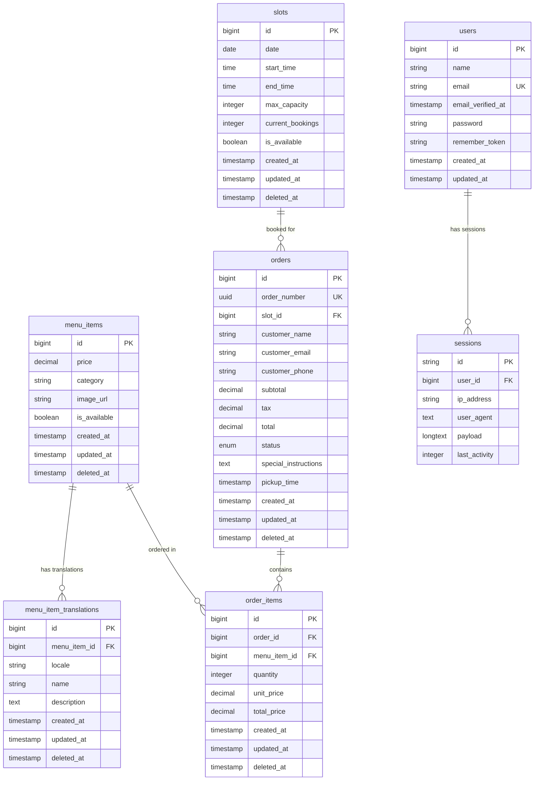

# Data Model Documentation

## Overview
このドキュメントは、モバイルオーダーアプリのデータベース設計とモデル関係を詳細に記載しています。

## Database Schema

### Core Business Tables

#### menu_items
メニューアイテムのマスターテーブル

| Column | Type | Constraints | Description |
|--------|------|-------------|-------------|
| id | BIGINT UNSIGNED | PRIMARY KEY, AUTO_INCREMENT | メニューアイテムID |
| price | DECIMAL(8,2) | NOT NULL | 価格 |
| category | VARCHAR(255) | NOT NULL | カテゴリ |
| image_url | VARCHAR(255) | NULLABLE | 画像URL |
| is_available | BOOLEAN | DEFAULT true | 利用可能フラグ |
| created_at | TIMESTAMP | NOT NULL | 作成日時 |
| updated_at | TIMESTAMP | NOT NULL | 更新日時 |
| deleted_at | TIMESTAMP | NULLABLE | 論理削除日時 |

**Indexes:**
- PRIMARY KEY (id)
- INDEX (deleted_at) - Soft Delete用

**Data Retention:** 論理削除により永続保持

---

#### menu_item_translations
メニューアイテムの多言語翻訳テーブル

| Column | Type | Constraints | Description |
|--------|------|-------------|-------------|
| id | BIGINT UNSIGNED | PRIMARY KEY, AUTO_INCREMENT | 翻訳ID |
| menu_item_id | BIGINT UNSIGNED | FOREIGN KEY, NOT NULL | メニューアイテムID |
| locale | VARCHAR(5) | NOT NULL | 言語コード (ja, en) |
| name | VARCHAR(255) | NOT NULL | 翻訳された名前 |
| description | TEXT | NULLABLE | 翻訳された説明 |
| created_at | TIMESTAMP | NOT NULL | 作成日時 |
| updated_at | TIMESTAMP | NOT NULL | 更新日時 |
| deleted_at | TIMESTAMP | NULLABLE | 論理削除日時 |

**Indexes:**
- PRIMARY KEY (id)
- UNIQUE KEY (menu_item_id, locale)
- INDEX (locale)
- INDEX (deleted_at)

**Foreign Keys:**
- menu_item_id REFERENCES menu_items(id) ON DELETE CASCADE

**Data Retention:** 論理削除により永続保持

---

#### slots
時間スロット管理テーブル

| Column | Type | Constraints | Description |
|--------|------|-------------|-------------|
| id | BIGINT UNSIGNED | PRIMARY KEY, AUTO_INCREMENT | スロットID |
| date | DATE | NOT NULL | 日付 |
| start_time | TIME | NOT NULL | 開始時間 |
| end_time | TIME | NOT NULL | 終了時間 |
| max_capacity | INTEGER | DEFAULT 10 | 最大収容数 |
| current_bookings | INTEGER | DEFAULT 0 | 現在の予約数 |
| is_available | BOOLEAN | DEFAULT true | 利用可能フラグ |
| created_at | TIMESTAMP | NOT NULL | 作成日時 |
| updated_at | TIMESTAMP | NOT NULL | 更新日時 |
| deleted_at | TIMESTAMP | NULLABLE | 論理削除日時 |

**Indexes:**
- PRIMARY KEY (id)
- UNIQUE KEY (date, start_time, end_time)
- INDEX (date)
- INDEX (deleted_at)

**Data Retention:** 論理削除により永続保持

---

#### orders
注文管理テーブル

| Column | Type | Constraints | Description |
|--------|------|-------------|-------------|
| id | BIGINT UNSIGNED | PRIMARY KEY, AUTO_INCREMENT | 注文ID |
| order_number | UUID | UNIQUE, NOT NULL | 注文番号 |
| slot_id | BIGINT UNSIGNED | FOREIGN KEY, NOT NULL | スロットID |
| customer_name | VARCHAR(255) | NOT NULL | 顧客名 |
| customer_email | VARCHAR(255) | NULLABLE | 顧客メール |
| customer_phone | VARCHAR(255) | NULLABLE | 顧客電話番号 |
| subtotal | DECIMAL(10,2) | NOT NULL | 小計 |
| tax | DECIMAL(10,2) | DEFAULT 0 | 税額 |
| total | DECIMAL(10,2) | NOT NULL | 合計 |
| status | ENUM | DEFAULT 'pending' | 注文ステータス |
| special_instructions | TEXT | NULLABLE | 特別な指示 |
| pickup_time | TIMESTAMP | NULLABLE | 受取時間 |
| created_at | TIMESTAMP | NOT NULL | 作成日時 |
| updated_at | TIMESTAMP | NOT NULL | 更新日時 |
| deleted_at | TIMESTAMP | NULLABLE | 論理削除日時 |

**Status Values:** 'pending', 'accepted', 'cooking', 'ready', 'completed', 'canceled'

**Indexes:**
- PRIMARY KEY (id)
- UNIQUE KEY (order_number)
- INDEX (slot_id)
- INDEX (status)
- INDEX (created_at)
- INDEX (deleted_at)

**Foreign Keys:**
- slot_id REFERENCES slots(id) ON DELETE CASCADE

**Data Retention:** 論理削除により永続保持（会計・監査目的）

---

#### order_items
注文アイテム詳細テーブル

| Column | Type | Constraints | Description |
|--------|------|-------------|-------------|
| id | BIGINT UNSIGNED | PRIMARY KEY, AUTO_INCREMENT | 注文アイテムID |
| order_id | BIGINT UNSIGNED | FOREIGN KEY, NOT NULL | 注文ID |
| menu_item_id | BIGINT UNSIGNED | FOREIGN KEY, NOT NULL | メニューアイテムID |
| quantity | INTEGER | NOT NULL | 数量 |
| unit_price | DECIMAL(8,2) | NOT NULL | 単価 |
| total_price | DECIMAL(10,2) | NOT NULL | 合計価格 |
| created_at | TIMESTAMP | NOT NULL | 作成日時 |
| updated_at | TIMESTAMP | NOT NULL | 更新日時 |
| deleted_at | TIMESTAMP | NULLABLE | 論理削除日時 |

**Indexes:**
- PRIMARY KEY (id)
- INDEX (order_id)
- INDEX (menu_item_id)
- INDEX (deleted_at)

**Foreign Keys:**
- order_id REFERENCES orders(id) ON DELETE CASCADE
- menu_item_id REFERENCES menu_items(id) ON DELETE CASCADE

**Data Retention:** 論理削除により永続保持

---

### System Tables

#### users
ユーザー管理テーブル（将来の管理者機能用）

| Column | Type | Constraints | Description |
|--------|------|-------------|-------------|
| id | BIGINT UNSIGNED | PRIMARY KEY, AUTO_INCREMENT | ユーザーID |
| name | VARCHAR(255) | NOT NULL | ユーザー名 |
| email | VARCHAR(255) | UNIQUE, NOT NULL | メールアドレス |
| email_verified_at | TIMESTAMP | NULLABLE | メール認証日時 |
| password | VARCHAR(255) | NOT NULL | パスワード（ハッシュ化） |
| remember_token | VARCHAR(100) | NULLABLE | Remember Token |
| created_at | TIMESTAMP | NOT NULL | 作成日時 |
| updated_at | TIMESTAMP | NOT NULL | 更新日時 |

**Data Retention:** 永続保持

---

#### sessions
セッション管理テーブル

| Column | Type | Constraints | Description |
|--------|------|-------------|-------------|
| id | VARCHAR(255) | PRIMARY KEY | セッションID |
| user_id | BIGINT UNSIGNED | NULLABLE, INDEX | ユーザーID |
| ip_address | VARCHAR(45) | NULLABLE | IPアドレス |
| user_agent | TEXT | NULLABLE | User Agent |
| payload | LONGTEXT | NOT NULL | セッションデータ |
| last_activity | INTEGER | INDEX | 最終アクティビティ |

**Data Retention:** 自動期限切れ（設定による）

---

#### cache / cache_locks
キャッシュ管理テーブル

| Table | Key Column | Value Column | Expiration |
|-------|------------|--------------|------------|
| cache | key (PRIMARY) | value (MEDIUMTEXT) | expiration (INTEGER) |
| cache_locks | key (PRIMARY) | owner (VARCHAR) | expiration (INTEGER) |

**Data Retention:** 自動期限切れ

---

#### jobs / job_batches / failed_jobs
キュー・ジョブ管理テーブル

**jobs:**
- id, queue, payload, attempts, reserved_at, available_at, created_at

**job_batches:**
- id, name, total_jobs, pending_jobs, failed_jobs, failed_job_ids, options, cancelled_at, created_at, finished_at

**failed_jobs:**
- id, uuid, connection, queue, payload, exception, failed_at

**Data Retention:** 設定による（通常は一定期間後削除）

---

## Entity Relationship Diagram



---

## Referential Integrity

### Foreign Key Constraints

#### CASCADE DELETE
以下の関係では親レコード削除時に子レコードも自動削除：

1. **menu_items → menu_item_translations**
   - `menu_item_translations.menu_item_id` → `menu_items.id`
   - メニューアイテム削除時、全ての翻訳も削除

2. **slots → orders**
   - `orders.slot_id` → `slots.id`
   - スロット削除時、関連する注文も削除

3. **orders → order_items**
   - `order_items.order_id` → `orders.id`
   - 注文削除時、注文アイテムも削除

4. **menu_items → order_items**
   - `order_items.menu_item_id` → `menu_items.id`
   - メニューアイテム削除時、関連する注文アイテムも削除

### Soft Delete Behavior
全ての主要テーブルで論理削除を実装：
- 物理削除ではなく `deleted_at` カラムに削除日時を記録
- クエリ時は自動的に `deleted_at IS NULL` 条件が追加
- `withTrashed()` で削除済みレコードも取得可能
- `restore()` で削除を取り消し可能

---

## Representative Queries

### 典型的なJOINクエリ

#### 1. 注文詳細取得（多言語対応）
```sql
-- N+1問題を回避するEager Loading
SELECT 
    o.*,
    s.date, s.time_slot,
    oi.quantity, oi.unit_price, oi.total_price,
    mi.price, mi.category,
    mit.name, mit.description
FROM orders o
INNER JOIN slots s ON o.slot_id = s.id
INNER JOIN order_items oi ON o.id = oi.order_id
INNER JOIN menu_items mi ON oi.menu_item_id = mi.id
LEFT JOIN menu_item_translations mit ON mi.id = mit.menu_item_id 
    AND mit.locale = 'ja'
WHERE o.id = ? 
    AND o.deleted_at IS NULL
    AND s.deleted_at IS NULL
    AND oi.deleted_at IS NULL
    AND mi.deleted_at IS NULL;
```

#### 2. 日別売上集計
```sql
SELECT 
    DATE(o.created_at) as order_date,
    COUNT(o.id) as total_orders,
    SUM(o.total) as total_revenue,
    COUNT(CASE WHEN o.status = 'completed' THEN 1 END) as completed_orders
FROM orders o
WHERE o.created_at >= '2024-01-01'
    AND o.deleted_at IS NULL
GROUP BY DATE(o.created_at)
ORDER BY order_date DESC;
```

#### 3. 人気メニューランキング
```sql
SELECT 
    mi.id,
    mit.name,
    mi.category,
    SUM(oi.quantity) as total_ordered,
    COUNT(DISTINCT oi.order_id) as order_count,
    AVG(oi.unit_price) as avg_price
FROM menu_items mi
INNER JOIN menu_item_translations mit ON mi.id = mit.menu_item_id 
    AND mit.locale = 'ja'
INNER JOIN order_items oi ON mi.id = oi.menu_item_id
INNER JOIN orders o ON oi.order_id = o.id
WHERE o.status IN ('completed', 'ready')
    AND o.created_at >= DATE_SUB(NOW(), INTERVAL 30 DAY)
    AND mi.deleted_at IS NULL
    AND oi.deleted_at IS NULL
    AND o.deleted_at IS NULL
GROUP BY mi.id, mit.name, mi.category
ORDER BY total_ordered DESC
LIMIT 10;
```

### N+1問題の懸念箇所と対策

#### 懸念箇所1: 注文一覧での関連データ取得
```php
// ❌ N+1問題が発生するパターン
$orders = Order::all();
foreach ($orders as $order) {
    echo $order->slot->time_slot; // N+1クエリ発生
    foreach ($order->orderItems as $item) { // N+1クエリ発生
        echo $item->menuItem->name; // N+1クエリ発生
    }
}

// ✅ Eager Loadingで解決
$orders = Order::with([
    'slot',
    'orderItems.menuItem.translations' => function($query) {
        $query->where('locale', 'ja');
    }
])->get();
```

#### 懸念箇所2: メニューアイテムの多言語対応
```php
// ❌ N+1問題が発生するパターン
$menuItems = MenuItem::all();
foreach ($menuItems as $item) {
    echo $item->getLocalizedName('ja'); // 翻訳取得でN+1発生
}

// ✅ scopeWithLocaleで解決
$menuItems = MenuItem::withLocale('ja', 'ja')->get();
```

#### 懸念箇所3: 管理画面での統計情報
```php
// ❌ 複数クエリが発生するパターン
$orders = Order::whereDate('created_at', today())->get();
$totalRevenue = $orders->sum('total'); // メモリ上で計算
$statusCounts = [];
foreach (['pending', 'accepted', 'cooking'] as $status) {
    $statusCounts[$status] = Order::where('status', $status)
        ->whereDate('created_at', today())->count(); // 個別クエリ
}

// ✅ 集約クエリで解決
$stats = Order::selectRaw('
    COUNT(*) as total_orders,
    SUM(total) as total_revenue,
    SUM(CASE WHEN status = "pending" THEN 1 ELSE 0 END) as pending_count,
    SUM(CASE WHEN status = "accepted" THEN 1 ELSE 0 END) as accepted_count,
    SUM(CASE WHEN status = "cooking" THEN 1 ELSE 0 END) as cooking_count
')->whereDate('created_at', today())->first();
```

---

## Performance Considerations

### インデックス戦略
1. **複合インデックス**
   - `slots(date, start_time, end_time)` - 時間スロット検索用
   - `menu_item_translations(menu_item_id, locale)` - 多言語検索用

2. **単一インデックス**
   - `orders(status)` - ステータス別フィルタ用
   - `orders(created_at)` - 日付範囲検索用
   - `menu_item_translations(locale)` - 言語別検索用

### クエリ最適化
1. **Soft Delete考慮**
   - 全てのクエリで `deleted_at IS NULL` 条件が自動追加
   - `deleted_at` カラムにインデックス設定

2. **Eager Loading**
   - 関連データは事前にロードしてN+1問題を回避
   - 特に多言語翻訳データの取得に注意

3. **集約クエリ**
   - 統計情報はアプリケーション側ではなくDB側で計算
   - `COUNT()`, `SUM()`, `GROUP BY` を活用

---

## Data Retention Policy

### 永続保持
- **menu_items, menu_item_translations**: 商品マスター
- **orders, order_items**: 会計・監査目的
- **users**: 管理者アカウント

### 期限付き保持
- **slots**: 過去のスロットは定期的にアーカイブ
- **sessions**: セッション期限切れで自動削除
- **cache**: TTL設定による自動削除
- **jobs**: 完了後一定期間で削除

### 論理削除の利点
1. **データ整合性**: 関連データを保持したまま非表示化
2. **監査証跡**: 削除操作の履歴を保持
3. **復旧可能性**: 誤削除からの復旧が可能
4. **分析継続**: 過去データを含めた分析が可能

---

## Reference Files
- `api/database/migrations/` - データベーススキーマ定義
- `api/app/Models/` - Eloquentモデル定義
- `api/app/Http/Controllers/` - ビジネスロジック実装