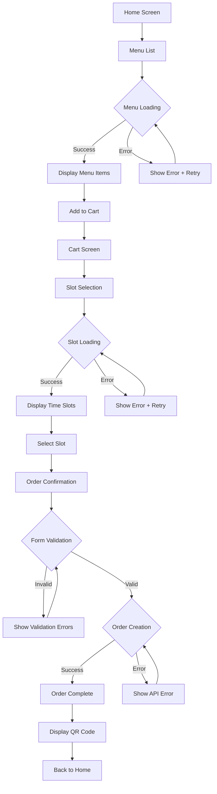
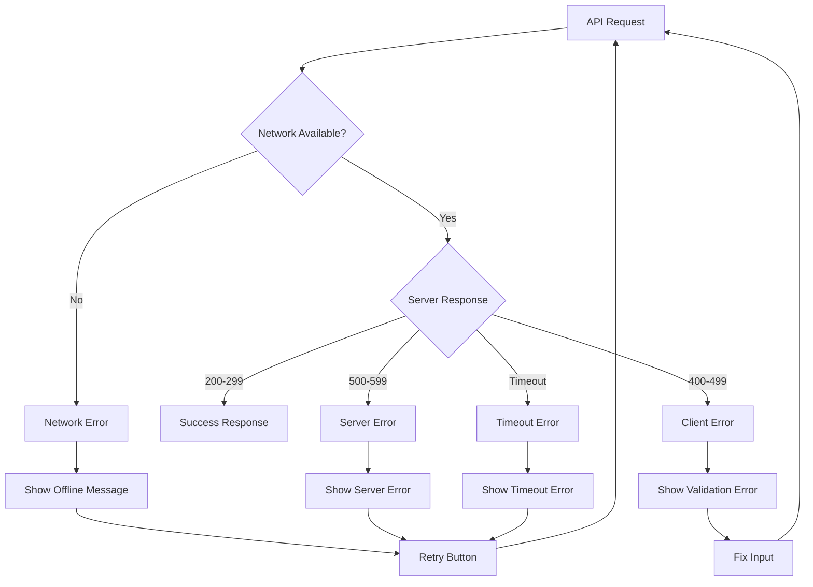
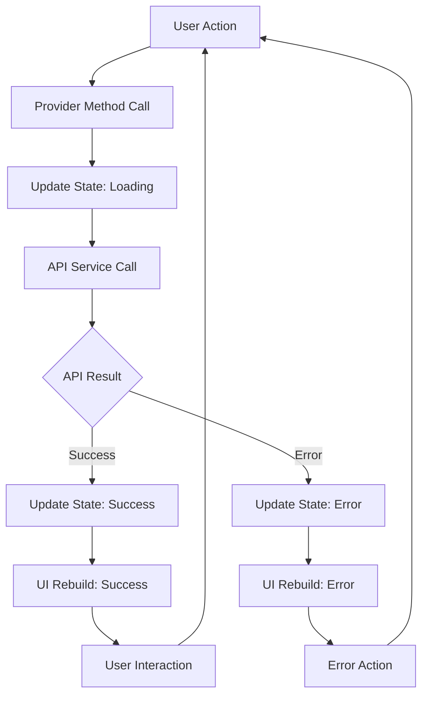
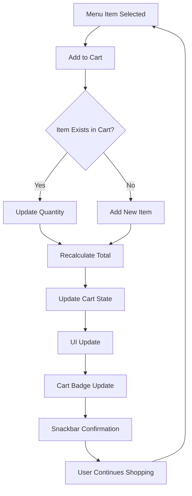
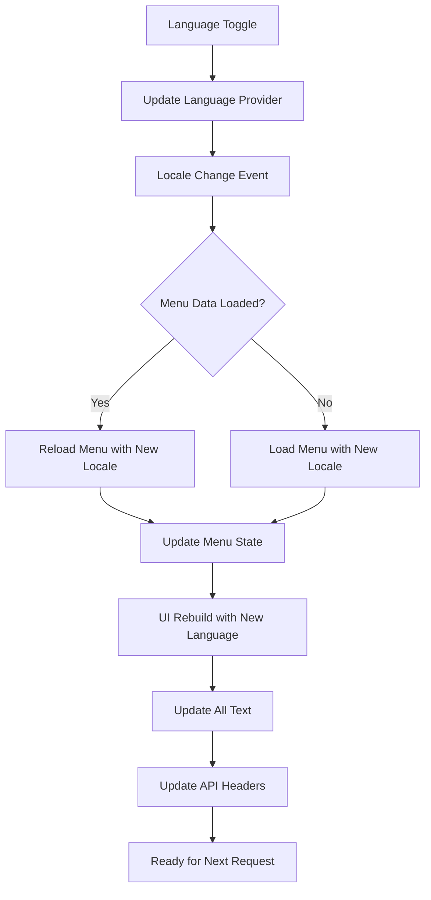

# Mobile Flows Documentation

## Overview
このドキュメントは、Flutterモバイルオーダーアプリの画面フロー、状態管理、非同期処理を詳細に記載しています。

## Screen List & Routes

| Screen | Route Path | Route Name | Description |
|--------|------------|------------|-------------|
| HomeScreen | `/` | home | アプリのホーム画面 |
| MenuListScreen | `/menu` | menu_list | メニュー一覧表示 |
| MenuDetailScreen | `/menu/:id` | menu_detail | メニュー詳細表示 |
| CartScreen | `/cart` | cart | カート内容確認・編集 |
| SlotSelectionScreen | `/slot-selection` | slot_selection | 受取時間選択 |
| OrderConfirmationScreen | `/order-confirmation` | order_confirmation | 注文確認・顧客情報入力 |
| OrderCompleteScreen | `/order-complete` | order_complete | 注文完了・QRコード表示 |
| HelpScreen | `/help` | help | ヘルプ・使い方ガイド |

---

## Screen Flow Analysis

### 1. HomeScreen (`/`)

#### Input → Processing → Output
- **Input**: アプリ起動、ナビゲーション
- **Processing**: 
  - 言語設定の初期化
  - 基本UI表示
- **Output**: 
  - **Screen**: メニューボタン、カートボタン、時間選択ボタン表示
  - **Navigation**: `/menu`, `/cart`, `/slot-selection`への遷移

#### State Management
- **Providers**: `languageProvider`
- **Local State**: なし

#### Error Handling
- エラー処理なし（静的画面）

---

### 2. MenuListScreen (`/menu`)

#### Input → Processing → Output
- **Input**: 
  - 画面初期化
  - 言語変更
  - リフレッシュボタンタップ
  - メニューアイテムタップ
  - カートに追加ボタンタップ
- **Processing**:
  - **API Call**: `GET /api/menu` (多言語ヘッダー付き)
  - **State Update**: `MenuState` (items, isLoading, error)
  - **Cart Update**: アイテム追加時
- **Output**:
  - **Screen**: メニューリスト、ローディング、エラー表示
  - **API**: メニューデータ取得
  - **Navigation**: `/menu/:id`, `/cart`への遷移
  - **Snackbar**: カート追加確認メッセージ

#### State Management
- **Providers**: 
  - `menuProvider` (MenuNotifier)
  - `cartProvider` (CartNotifier)
  - `languageProvider` (LanguageNotifier)
- **Async State**: `MenuState{items, isLoading, error}`

#### Error Handling
```dart
// Network Error Flow
try {
  final items = await _apiService.getMenu(locale: locale);
  state = state.copyWith(items: items, isLoading: false);
} catch (e) {
  state = state.copyWith(
    isLoading: false,
    error: 'Failed to load menu. Please check your connection and try again.',
  );
}
```

#### Failure Branches
- **Network Error**: エラーメッセージ + リトライボタン表示
- **Empty Data**: "No menu items" メッセージ表示
- **Language Fallback**: 翻訳がない場合は日本語にフォールバック

---

### 3. MenuDetailScreen (`/menu/:id`)

#### Input → Processing → Output
- **Input**: メニューアイテムID (パスパラメータ)
- **Processing**: 現在は基本実装のみ
- **Output**: **Screen**: メニューID表示

#### State Management
- **Providers**: なし（現在未実装）
- **Future Enhancement**: `menuItemProvider` で詳細データ取得

---

### 4. CartScreen (`/cart`)

#### Input → Processing → Output
- **Input**:
  - カートアイテムの数量変更 (+/-)
  - アイテム削除
  - カートクリア
  - 受取時間選択ボタンタップ
- **Processing**:
  - **State Update**: `CartState` (items, total, itemCount)
  - **Calculation**: 合計金額の再計算
- **Output**:
  - **Screen**: カートアイテムリスト、合計金額、空カート表示
  - **Navigation**: `/slot-selection`への遷移

#### State Management
- **Providers**: 
  - `cartProvider` (CartNotifier)
  - `languageProvider` (LanguageNotifier)
- **Local State**: `CartState{items, total}`

#### Error Handling
- エラー処理なし（ローカル状態管理のみ）

---

### 5. SlotSelectionScreen (`/slot-selection`)

#### Input → Processing → Output
- **Input**:
  - 画面初期化
  - 日付フィルター選択
  - 時間スロット選択
  - リフレッシュボタンタップ
  - 確認ボタンタップ
- **Processing**:
  - **API Call**: `GET /api/slots?date={date}`
  - **State Update**: `SlotState` (groupedSlots, selectedSlot, isLoading, error)
  - **Validation**: スロット選択状態確認
- **Output**:
  - **Screen**: 日付フィルター、スロットグリッド、選択状態表示
  - **API**: スロットデータ取得
  - **Navigation**: `/order-confirmation`への遷移

#### State Management
- **Providers**: `slotProvider` (SlotNotifier)
- **Async State**: `SlotState{groupedSlots, selectedSlot, isLoading, error}`

#### Error Handling
```dart
// Slot Loading Error Flow
try {
  final groupedSlots = await _apiService.getSlots(date: date);
  // Clear selected slot if no longer available
  Slot? currentSelection = state.selectedSlot;
  if (currentSelection != null) {
    bool slotStillAvailable = false;
    for (final slots in groupedSlots.values) {
      if (slots.any((slot) => slot.id == currentSelection!.id)) {
        slotStillAvailable = true;
        break;
      }
    }
    if (!slotStillAvailable) {
      currentSelection = null;
    }
  }
  state = state.copyWith(
    groupedSlots: groupedSlots,
    isLoading: false,
    selectedSlot: currentSelection,
  );
} catch (e) {
  state = state.copyWith(
    isLoading: false,
    error: e.toString(),
  );
}
```

#### Failure Branches
- **Network Error**: エラーメッセージ + リトライボタン表示
- **No Slots Available**: "No time slots available" メッセージ表示
- **Selected Slot Unavailable**: 選択解除 + 再選択促進

---

### 6. OrderConfirmationScreen (`/order-confirmation`)

#### Input → Processing → Output
- **Input**:
  - 顧客情報フォーム入力 (名前、メール、電話番号)
  - 特別指示入力
  - 注文確定ボタンタップ
- **Processing**:
  - **Form Validation**: 必須項目・メール形式チェック
  - **API Call**: `POST /api/orders`
  - **State Update**: `OrderState` (currentOrder, isLoading, error)
  - **State Clear**: カート・スロット選択のクリア
- **Output**:
  - **Screen**: 注文サマリー、顧客情報フォーム、エラー表示
  - **API**: 注文作成
  - **Navigation**: `/order-complete`への遷移

#### State Management
- **Providers**: 
  - `orderProvider` (OrderNotifier)
  - `cartProvider` (CartNotifier)
  - `slotProvider` (SlotNotifier)
- **Local State**: フォームコントローラー
- **Async State**: `OrderState{currentOrder, isLoading, error}`

#### Error Handling
```dart
// Order Creation Error Flow
try {
  final order = await _apiService.createOrder(
    slotId: slotId,
    customerName: customerName,
    customerEmail: customerEmail,
    customerPhone: customerPhone,
    items: items,
    specialInstructions: specialInstructions,
  );
  
  state = state.copyWith(
    currentOrder: order,
    isLoading: false,
  );
} catch (e) {
  state = state.copyWith(
    isLoading: false,
    error: e.toString(),
  );
}
```

#### Failure Branches
- **Validation Error**: フォームフィールドエラー表示
- **Empty Cart**: "Your cart is empty" 画面表示
- **No Slot Selected**: "Please select pickup time" 画面表示
- **API Error**: エラーメッセージ表示 + リトライ可能
- **Network Error**: 接続エラーメッセージ表示

---

### 7. OrderCompleteScreen (`/order-complete`)

#### Input → Processing → Output
- **Input**:
  - 注文完了後の遷移
  - ホームボタンタップ
  - 追加注文ボタンタップ
- **Processing**:
  - **QR Code Generation**: 注文番号からQRコード生成
  - **Order Display**: 注文詳細表示
- **Output**:
  - **Screen**: 成功メッセージ、注文詳細、QRコード、アクションボタン
  - **Navigation**: `/`, `/menu`への遷移

#### State Management
- **Providers**: `orderProvider` (OrderNotifier)
- **Local State**: なし

#### Error Handling
- **No Order**: "No order found" メッセージ + ホーム誘導

---

### 8. HelpScreen (`/help`)

#### Input → Processing → Output
- **Input**: ヘルプ画面表示
- **Processing**: 静的コンテンツ表示
- **Output**: **Screen**: ステップバイステップガイド、ヒント、連絡先情報

#### State Management
- **Providers**: `languageProvider` (多言語対応)
- **Local State**: なし

#### Error Handling
- エラー処理なし（静的画面）

---

## State Management Architecture

### Provider Structure
```dart
// Global Providers
final languageProvider = StateNotifierProvider<LanguageNotifier, Locale>
final apiServiceProvider = Provider<ApiService>
final apiBaseUrlProvider = Provider<String>

// Feature Providers
final menuProvider = StateNotifierProvider<MenuNotifier, MenuState>
final cartProvider = StateNotifierProvider<CartNotifier, CartState>
final slotProvider = StateNotifierProvider<SlotNotifier, SlotState>
final orderProvider = StateNotifierProvider<OrderNotifier, OrderState>
```

### State Classes
```dart
// Menu State
class MenuState {
  final List<MenuItem> items;
  final bool isLoading;
  final String? error;
}

// Cart State
class CartState {
  final List<CartItem> items;
  final double total;
  final int itemCount; // computed property
}

// Slot State
class SlotState {
  final Map<String, List<Slot>> groupedSlots;
  final bool isLoading;
  final String? error;
  final Slot? selectedSlot;
}

// Order State
class OrderState {
  final Order? currentOrder;
  final bool isLoading;
  final String? error;
}
```

---

## Async Processing & Error Handling

### Network Layer Error Handling
```dart
class ApiService {
  Future<T> _handleRequest<T>(Future<T> Function() request) async {
    try {
      return await request();
    } on SocketException {
      throw Exception('No internet connection');
    } on TimeoutException {
      throw Exception('Request timeout');
    } on FormatException {
      throw Exception('Invalid response format');
    } catch (e) {
      throw Exception('Network error: $e');
    }
  }
}
```

### Provider Error Patterns
```dart
// Loading Pattern
state = state.copyWith(isLoading: true, error: null);

// Success Pattern
state = state.copyWith(items: data, isLoading: false);

// Error Pattern
state = state.copyWith(
  isLoading: false,
  error: 'User-friendly error message',
);
```

### UI Error Display Patterns
1. **Full Screen Error**: ネットワークエラー、データなし
2. **Inline Error**: フォームバリデーション
3. **Snackbar Error**: 一時的なエラー
4. **Error Card**: 部分的なエラー

---

## Representative Flow Diagrams

### Main Order Flow


### Error Handling Flow


### State Management Flow


### Cart Management Flow


### Language Switching Flow


---

## Performance Considerations

### N+1 Problem Prevention
- **Eager Loading**: Provider内で関連データを事前取得
- **Batch Requests**: 複数アイテムを一度に取得
- **Caching**: 言語切り替え時のデータキャッシュ

### Memory Management
- **Provider Disposal**: 画面離脱時の適切なクリーンアップ
- **Image Caching**: ネットワーク画像のキャッシュ戦略
- **State Reset**: 注文完了後の状態リセット

### User Experience
- **Loading States**: 全ての非同期処理にローディング表示
- **Error Recovery**: エラー時のリトライ機能
- **Offline Handling**: ネットワーク切断時の適切な表示

---

## Reference Files
- `app/lib/main.dart` - アプリエントリーポイント
- `app/lib/router/app_router.dart` - ルーティング定義
- `app/lib/providers/` - 状態管理プロバイダー
- `app/lib/screens/` - 画面実装
- `app/lib/services/api_service.dart` - API通信層