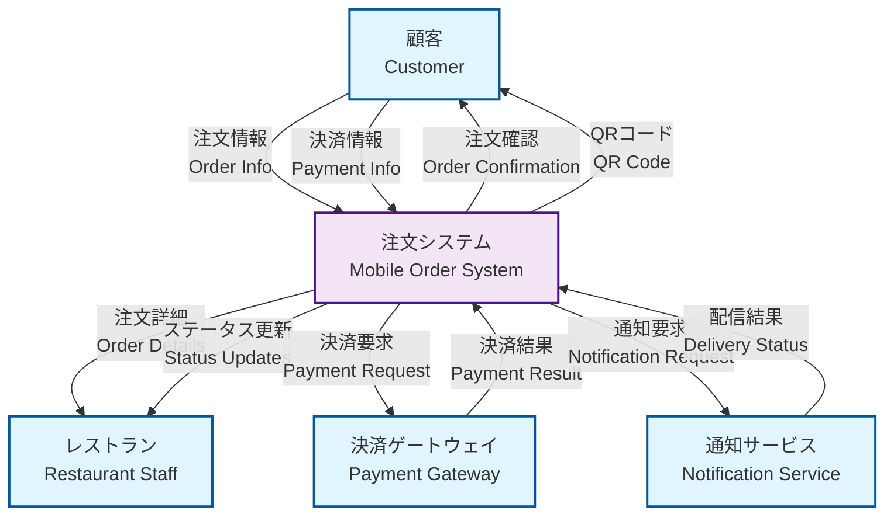
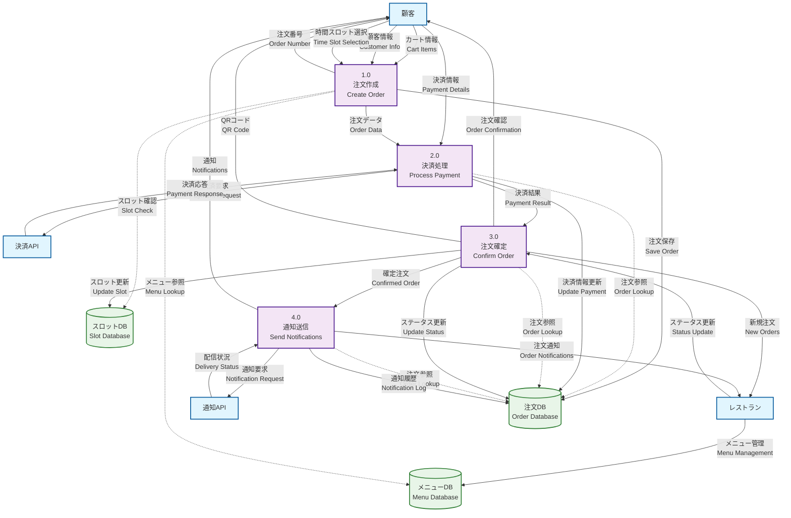
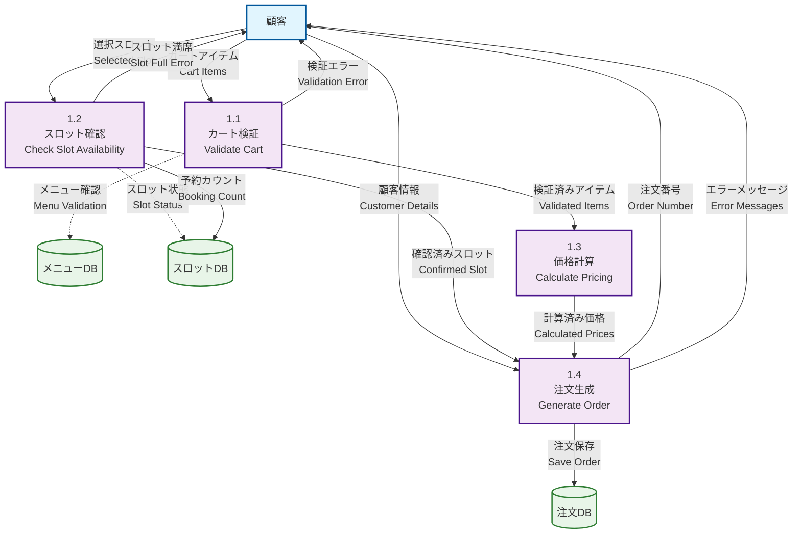

# Data Flow Diagram Overview

## 注文システム全体のデータフロー図

このドキュメントでは、モバイルオーダーアプリの注文作成から決済、確定、通知までの全体的なデータフローをMermaidのDFD（Data Flow Diagram）で表現します。

## システム概要

注文システムは以下の主要プロセスで構成されています：
1. **注文作成** - 顧客情報とカート内容から注文を生成
2. **決済処理** - 決済サービスとの連携（将来実装予定）
3. **注文確定** - 在庫確認と最終確定
4. **通知送信** - 顧客・店舗への通知（将来実装予定）

## Level 0 DFD - システム全体概要

## Level 1 DFD - 注文システム詳細

## Level 2 DFD - 注文作成プロセス詳細

## データストア詳細

### 1. メニューDB (Menu Database)
- **格納データ**: メニューアイテム、価格、カテゴリ、多言語翻訳
- **アクセスパターン**: 読み取り中心、管理者による更新
- **整合性**: 論理削除による履歴保持

### 2. 注文DB (Order Database)
- **格納データ**: 注文情報、顧客情報、注文アイテム、ステータス
- **アクセスパターン**: 作成・更新・参照
- **整合性**: トランザクション制御、外部キー制約

### 3. スロットDB (Slot Database)
- **格納データ**: 時間スロット、容量、現在予約数
- **アクセスパターン**: 頻繁な更新（予約カウント）
- **整合性**: 楽観的ロック、容量制限チェック

## プロセス詳細

### 1.0 注文作成 (Create Order)
- **入力**: カート情報、顧客情報、時間スロット
- **処理**: バリデーション、価格計算、注文生成
- **出力**: 注文番号、エラーメッセージ
- **例外処理**: 在庫切れ、スロット満席、バリデーションエラー

### 2.0 決済処理 (Process Payment)
- **入力**: 注文データ、決済情報
- **処理**: 決済API呼び出し、結果処理
- **出力**: 決済結果、トランザクションID
- **例外処理**: 決済失敗、タイムアウト、ネットワークエラー

### 3.0 注文確定 (Confirm Order)
- **入力**: 決済結果、注文データ
- **処理**: 最終確認、ステータス更新、スロット確定
- **出力**: 注文確認、QRコード
- **例外処理**: 決済失敗時のロールバック

### 4.0 通知送信 (Send Notifications)
- **入力**: 確定注文情報
- **処理**: 通知メッセージ生成、配信
- **出力**: 通知結果、配信ステータス
- **例外処理**: 配信失敗、リトライ処理

## 現在の実装状況

### ✅ 実装済み
- 注文作成プロセス (1.0)
- 基本的な注文確定 (3.0の一部)
- データベース設計

### 🚧 部分実装
- 注文ステータス管理
- エラーハンドリング

### ⏳ 未実装（将来予定）
- 決済処理 (2.0)
- 通知送信 (4.0)
- 高度なエラー処理
- リアルタイム更新

## セキュリティ考慮事項

### データ保護
- 顧客情報の暗号化
- 決済情報の非保持
- アクセスログの記録

### 整合性保証
- トランザクション制御
- 楽観的ロック
- データバリデーション

### 可用性確保
- エラー処理とリトライ
- フェイルセーフ機能
- 監視とアラート

---

**参考資料**
- API契約書: `api_contracts.md`
- データモデル: `data_model.md`
- モバイルフロー: `mobile_flows.md`