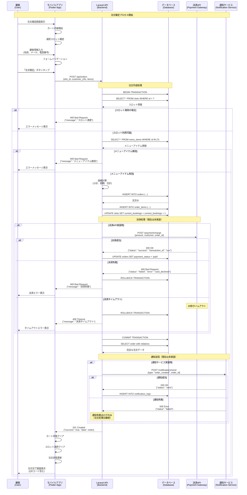
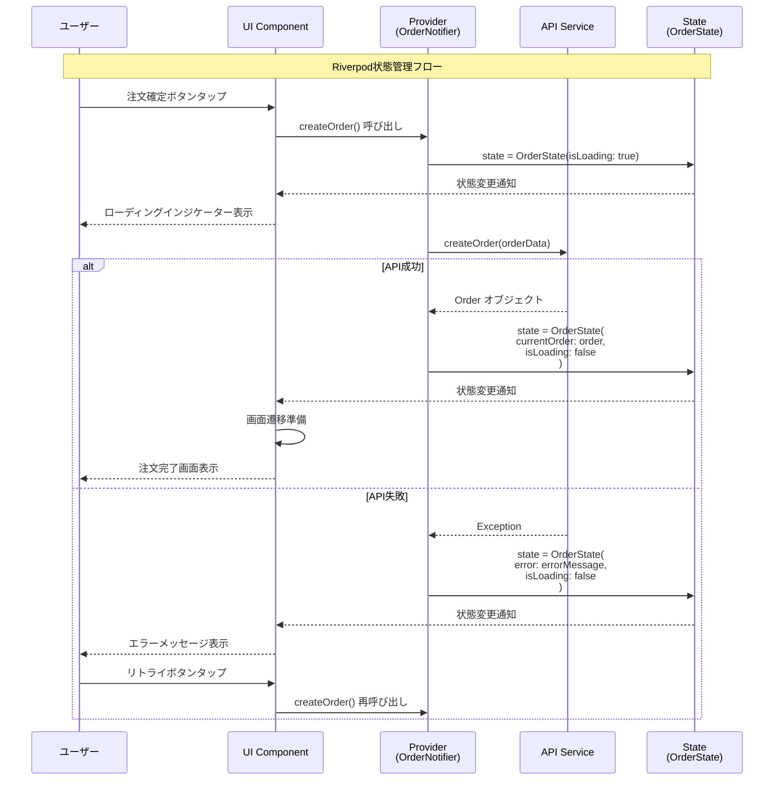
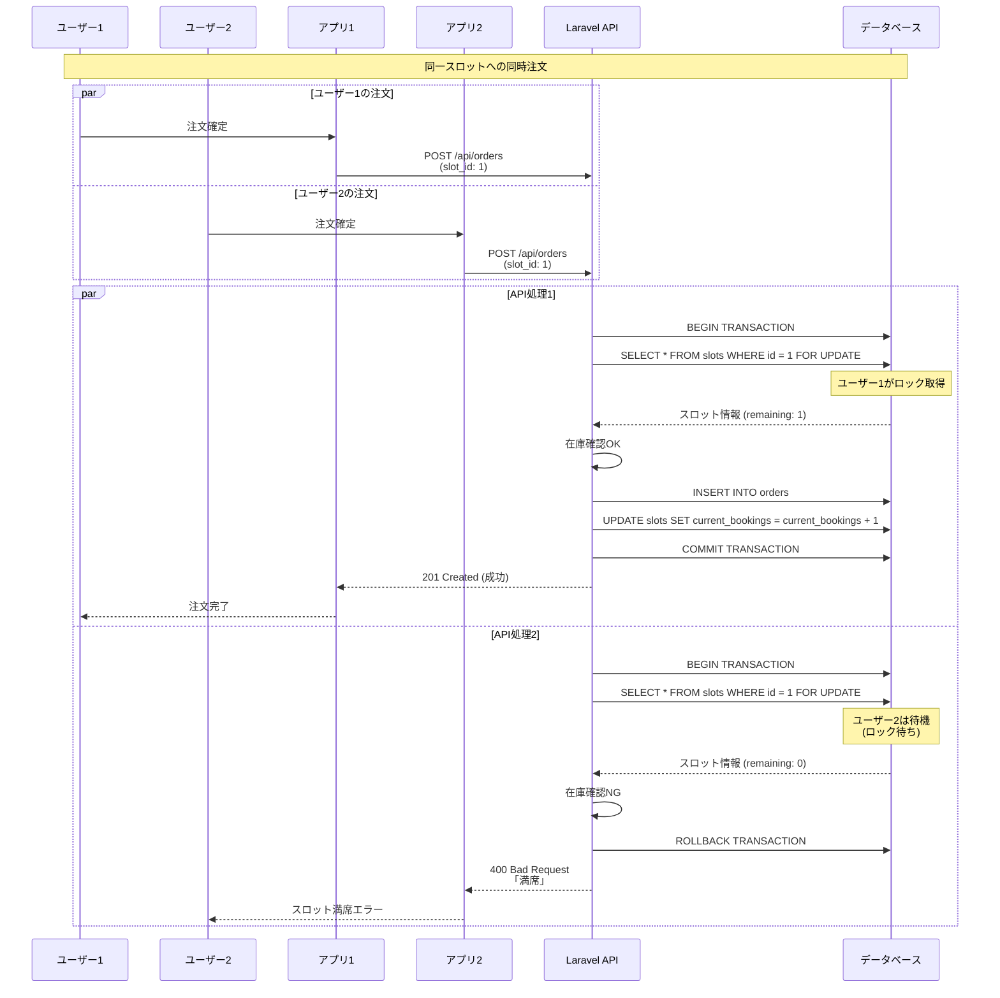
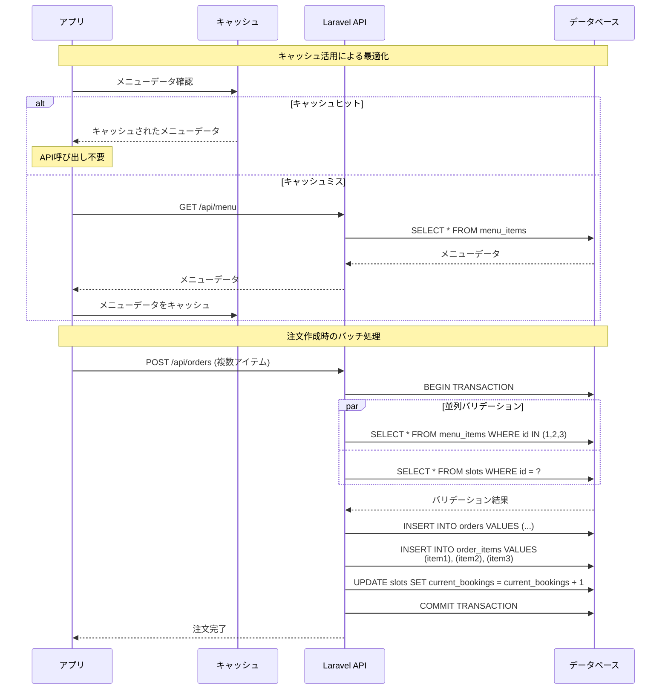
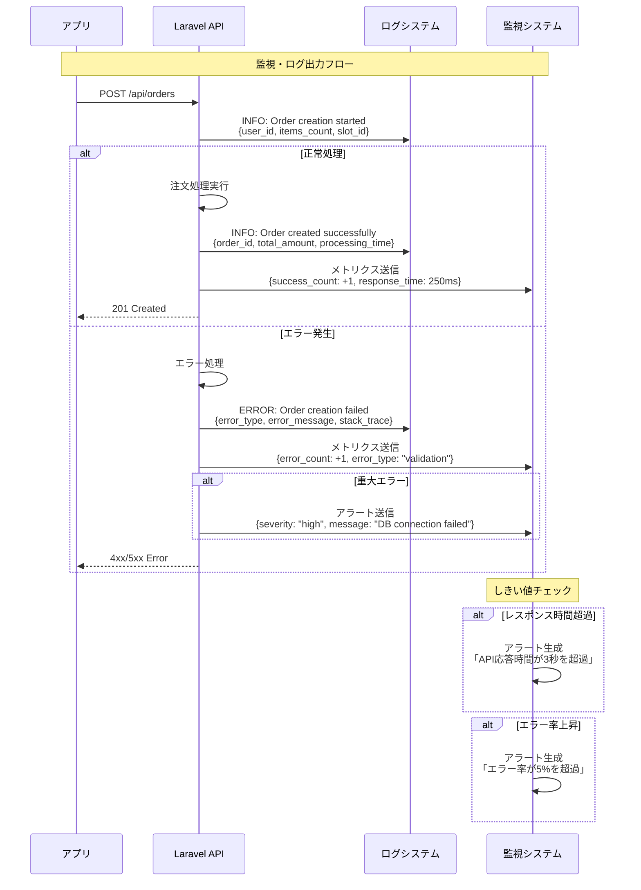

# 注文確定シーケンス図

## カート→注文確定→決済API→結果反映のシーケンス

このドキュメントでは、モバイルオーダーアプリの注文確定プロセスを詳細なシーケンス図で表現し、成功系・失敗系の両方のフローを明示します。

## 基本注文フロー（成功系）



## エラーハンドリング詳細シーケンス

```mermaid
sequenceDiagram
    participant U as 顧客
    participant A as アプリ
    participant API as Laravel API
    participant DB as データベース
    participant Pay as 決済API

    Note over U,Pay: エラーケース詳細

    U->>A: 注文確定ボタンタップ
    A->>API: POST /api/orders

    %% ケース1: バリデーションエラー
    alt バリデーションエラー
        API->>API: リクエストバリデーション
        API-->>A: 422 Unprocessable Entity<br/>{"errors": {"customer_name": ["必須項目"]}}
        A->>A: フォームエラー表示
        A-->>U: 入力エラーメッセージ
        U->>A: エラー修正・再送信
        A->>API: POST /api/orders (再試行)
    
    %% ケース2: スロット競合
    else スロット競合エラー
        API->>DB: BEGIN TRANSACTION
        API->>DB: SELECT * FROM slots WHERE id = ? FOR UPDATE
        DB-->>API: スロット情報 (current_bookings = max_capacity)
        API->>DB: ROLLBACK TRANSACTION
        API-->>A: 400 Bad Request<br/>{"message": "選択した時間は満席です"}
        A-->>U: スロット満席エラー
        U->>A: 別スロット選択
        A->>A: スロット選択画面に戻る
    
    %% ケース3: ネットワークエラー
    else ネットワークエラー
        Note over API: サーバー応答なし
        A->>A: タイムアウト検出 (30秒)
        A-->>U: 「接続エラー。再試行してください」
        U->>A: 再試行ボタンタップ
        A->>API: POST /api/orders (リトライ)
    
    %% ケース4: サーバーエラー
    else サーバー内部エラー
        API->>DB: データベース操作
        DB-->>API: エラー (接続失敗等)
        API-->>A: 500 Internal Server Error<br/>{"message": "サーバーエラー"}
        A-->>U: 「一時的なエラーです。しばらく後に再試行してください」
        
        Note over A: 自動リトライ (最大3回)
        loop 最大3回リトライ
            A->>A: 指数バックオフ待機<br/>(2秒, 4秒, 8秒)
            A->>API: POST /api/orders (自動リトライ)
            alt リトライ成功
                API-->>A: 201 Created
                break
            else リトライ失敗
                API-->>A: 500 Error
            end
        end
        
        alt 全リトライ失敗
            A-->>U: 「エラーが継続しています。サポートにお問い合わせください」
        end
    
    %% ケース5: 決済エラー（将来実装）
    else 決済関連エラー
        API->>DB: 注文作成成功
        API->>Pay: 決済要求
        
        alt カード情報エラー
            Pay-->>API: 400 Bad Request<br/>{"error": "invalid_card"}
            API->>DB: ROLLBACK TRANSACTION
            API-->>A: 400 Bad Request<br/>{"message": "カード情報が無効です"}
            A-->>U: カード情報エラー表示
        
        else 残高不足
            Pay-->>API: 400 Bad Request<br/>{"error": "insufficient_funds"}
            API->>DB: ROLLBACK TRANSACTION
            API-->>A: 400 Bad Request<br/>{"message": "残高不足です"}
            A-->>U: 残高不足エラー表示
        
        else 決済サービス障害
            Pay-->>API: 503 Service Unavailable
            API->>DB: ROLLBACK TRANSACTION
            API-->>A: 503 Service Unavailable<br/>{"message": "決済サービス一時停止"}
            A-->>U: 「決済サービスが一時的に利用できません」
        end
    end
```

## 状態管理とUI更新シーケンス



## 並行処理・競合状態の処理



## パフォーマンス最適化シーケンス



## 監視・ログ出力シーケンス



## 実装状況と将来拡張

### ✅ 現在実装済み
- 基本的な注文作成フロー
- バリデーション処理
- データベーストランザクション
- エラーハンドリング（基本）

### 🚧 部分実装
- 状態管理（Riverpod）
- UI エラー表示
- リトライ機能

### ⏳ 将来実装予定
- 決済API連携
- 通知サービス連携
- 高度な監視・ログ
- パフォーマンス最適化
- リアルタイム更新

### 🔧 技術的改善点
- 楽観的ロックの実装
- キャッシュ戦略の最適化
- 非同期処理の改善
- セキュリティ強化

---

**関連ドキュメント**
- DFD概要: `dfd_overview.md`
- API契約書: `../specs/api_contracts.md`
- モバイルフロー: `../specs/mobile_flows.md`